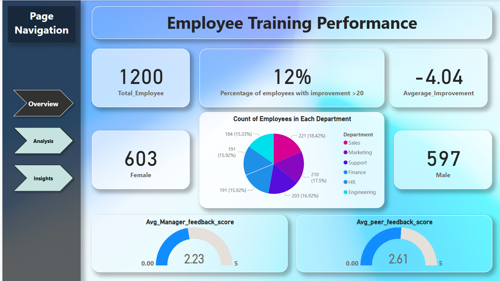
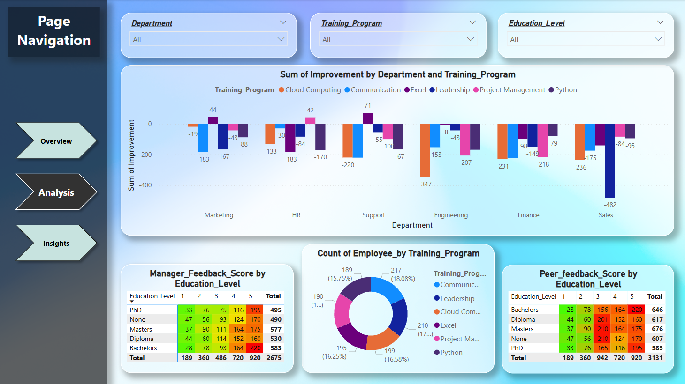
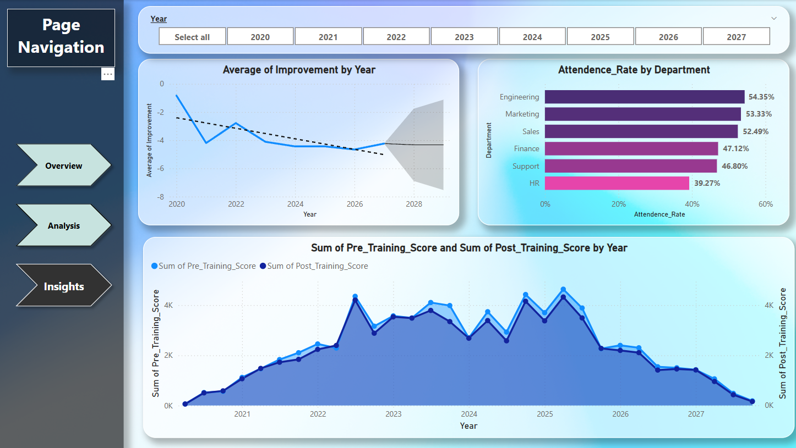

# 📊 Employee Training Performance Analysis – Power BI Dashboard  

## 📌 Project Overview  
This project analyzes employee training performance using **Power BI**, transforming raw training records into actionable insights for HR and management teams.  

The dashboard highlights training effectiveness, attendance, and feedback patterns, helping organizations measure ROI on training programs and optimize workforce development.  

---

## 🛠️ Tools & Technologies  
- **Power BI** – Data modeling, DAX measures, interactive dashboard  
- **Excel** – Data cleaning and preparation  
- **Data Visualization** – KPIs, charts, and reports  

---

## 🔹 Key Features  
- **Data Cleaning & Preparation**  
  - Standardized raw employee training data (dates, scores, attributes)  
  - Handled missing values and ensured data consistency  

- **Data Modeling**  
  - Calculated measures:  
    - *Improvement Score = Post Training – Pre Training*  
    - Employee categorization by **tenure** and **education level**  

- **Dashboard Insights**  
  - Training effectiveness by department  
  - Attendance vs. improvement distribution  
  - Manager and peer feedback analysis  
  - KPI cards: average improvement, % employees with positive progress, satisfaction levels  

---

## 📈 Dashboard Preview  

  
  
  
---

## 🔑 Business Impact  
- Provides HR teams with **data-driven insights** on training outcomes  
- Helps identify departments with the most improvement opportunities  
- Supports strategic workforce planning and training investment decisions  

---

## 📂 Repository Structure  
